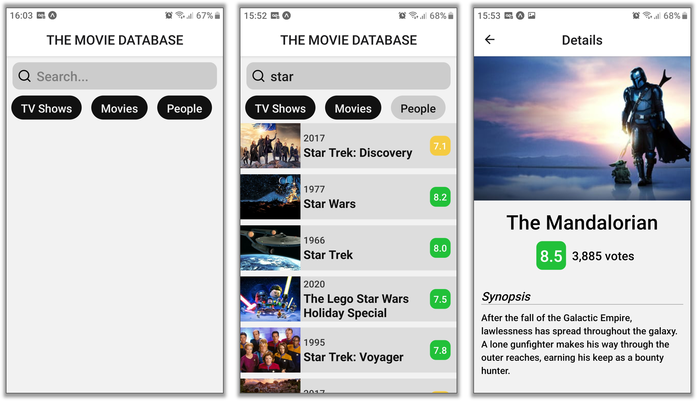

<h1 align="center">
  🎬 The Movie Search
</h1>

<p align="center">
  <a href="#trophy-lessons-learned">Lessons Learned</a>&nbsp;&nbsp;&nbsp;|&nbsp;&nbsp;&nbsp;
  <a href="#rocket-technologies--resources">Technologies</a>&nbsp;&nbsp;&nbsp;|&nbsp;&nbsp;&nbsp;
  <a href="#hammer-setting-up-the-environment">Environment Setup</a>
</p>

<p align="center">
  

  

  

  

  
</p>



Application developed as an assignment to college, subject Development for Mobile Devices, at UFPR, in order to learn building **React Native** applications. The project seeks to apply knowledge in functional components, components communication (via *props* and *lifting state up*), state management with Hooks, routing with React Navigation and REST API consumption.

The proposal was to build a simple mobile application to search movies, TV shows and famous people using [The Movie Database](https://developers.themoviedb.org/3/) REST API, and display details about the selected item. A good-looking app may earn extra points 😍.

## :trophy: Lessons Learned

- Project configuration using `.env` files;
- React Native Navigation (stack mode);
- Loading animation when awaiting asynchronous processing;
- Images carousel;
- [Styled Components](https://styled-components.com/);
- Fetching data from [TMDB](https://developers.themoviedb.org/3/) API;

## :rocket: Technologies & Resources

**Frontend:**
- React Native
- Expo Framework
- Styled Components
- Axios (HTTP client)

**Development:**
- Visual Studio Code
- NPM routines

## :hammer: Setting up the Environment

Before starting the development server, you need to set up the environment variables in a `.env` file, at the project root. For convenience, you can use `.env.example` as reference, so you'll know all the required variables to run the application properly. The most important one is **TMDB_API_KEY**, which requires you to add your API key.

Make sure to have **Node.js 10+** installed in your machine and its **npm** available in the command line, then use the following routines:

```bash
$ npm install   # download all dependencies
$ npm start     # run development server
```
